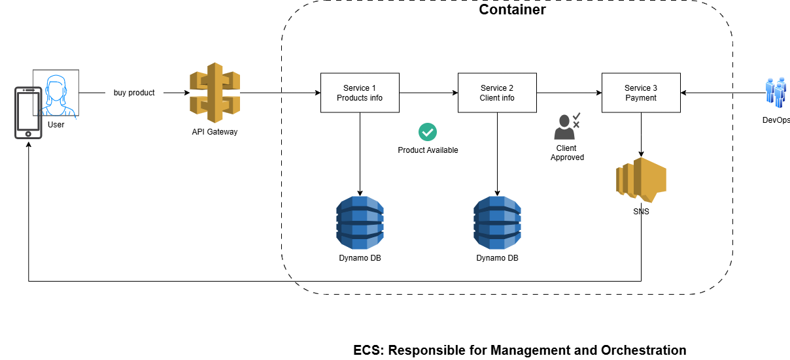

# 💻AWS NOTES: ECS 

## 🕵️‍♀️ECS: Amazon Elastic Container Service

Amazon ECS is responsible for container orchestration using a microservices architecture.

### 🤔Microservices vs Monolith architecture

Monolith Model: traditional Software architecture that uses one code base to perform multiple functions. Easier to build, but not ideal for scalability.

Microservices Model: Each function has its own code and operates independently of the entire architecture. When a deployment is done, the user's access is rarely damaged by it because microservices' deployments are done isolatedly. This model takes more time and effort during its development, but has better scalability.

[Info AWS website](https://aws.amazon.com/pt/compare/the-difference-between-monolithic-and-microservices-architecture/)

### 🤔What is a Container on AWS?

Containers are manageable packages of applications. In other words, they are isolated and portable Software units.

#### Why Use ECS?

- Ideal for tasks that require usage time > 15 minutes;

- Ideal when executing a code outside an AWS region;

### 🤔What is a Cluster on AWS?

According to \[AWS Cluster Documentation](https://docs.aws.amazon.com/AmazonECS/latest/APIReference/API\_Cluster.html), a cluster is a regional grouping of container instances where task requests are run. A cluster can keep one or multiple containers.

[On AWS website](https://docs.aws.amazon.com/AmazonECS/latest/APIReference/API\_Cluster.html)

### 🤔About ECR (Elastic Container Registry)

An ECR is a "storage" of containers that will be deployed on ECS.

### 📍Example of ECS

